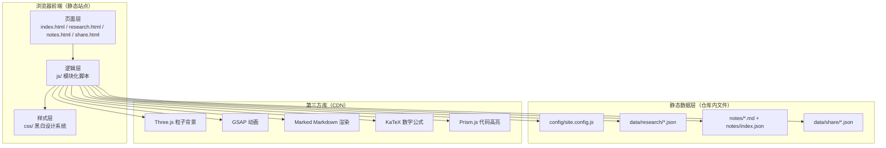

# RS NOTES 技术架构文档

## 1. 架构设计

RS NOTES 采用纯静态前端架构，无后端服务，所有内容数据以 JSON 与 Markdown 文件形式存储于仓库内，前端通过 fetch 加载并在浏览器端渲染。配置通过全局 `window.SITE_CONFIG` 注入，全站共享。



## 2. 技术说明

- **前端**：原生 HTML5 + CSS3 + 原生 JavaScript（ES6 模块），不使用框架
- **构建工具**：无构建步骤，直接通过静态服务器（如 `python -m http.server` 或 VS Code Live Server）运行
- **3D / 动画**：Three.js（粒子背景）、GSAP + ScrollTrigger（入场与滚动动画）
- **内容渲染**：Marked（Markdown → HTML）、KaTeX（数学公式）、Prism.js（代码高亮）
- **数据存储**：LocalStorage（阅读次数 `article_views_{id}`）
- **第三方库引入方式**：通过 CDN `<script>` 标签引入，部分核心库使用 ES Module 形式

### 设计令牌（CSS 变量）

```css
:root {
  --bg: #0a0a0a;
  --bg-elevated: #141414;
  --fg: #fafafa;
  --fg-muted: #999;
  --fg-subtle: #666;
  --border: #1f1f1f;
  --border-bright: #e5e5e5;
  --accent: #ffffff;
  --max-width: 1200px;
  --font-display: 'Fraunces', 'Source Han Serif SC', serif;
  --font-body: 'IBM Plex Sans', 'Source Han Sans SC', sans-serif;
  --font-mono: 'JetBrains Mono', monospace;
}
```

## 3. 路由定义

| 路由 | 用途 |
|------|------|
| `/index.html` | 首页：粒子背景 + Hero + 三模块入口 |
| `/research.html` | 科研页：项目墙 |
| `/research/project.html?id={id}` | 科研项目详情页（由 `?id=` 参数定位项目） |
| `/research/template.html` | 项目详情模板页 |
| `/notes.html` | 笔记页：标签云 + 文章列表 |
| `/notes/article.html?id={id}` | 笔记详情页（Markdown 渲染） |
| `/share.html` | 分享页：时间轴 + 瀑布流 |

## 4. 数据格式定义

### 4.1 站点配置 `config/site.config.js`

```js
window.SITE_CONFIG = {
  title: 'RS NOTES',
  subtitle: 'Research · Notes · Share',
  logo: '/assets/logo.svg',
  avatar: '/assets/avatar.svg',
  author: { name: 'RS', bio: 'Researcher & Developer' },
  social: [
    { name: 'GitHub', url: 'https://github.com/', icon: 'github' },
    { name: 'Email', url: 'mailto:', icon: 'mail' }
  ],
  nav: [
    { name: 'Home', url: '/index.html' },
    { name: 'Research', url: '/research.html' },
    { name: 'Notes', url: '/notes.html' },
    { name: 'Share', url: '/share.html' }
  ]
};
```

### 4.2 科研项目 `data/research/{id}.json`

```ts
interface ResearchProject {
  id: string;
  title: string;
  cover: string;        // 封面图路径
  tags: string[];
  status: 'ongoing' | 'completed' | 'planning';
  date: string;         // YYYY-MM
  intro: string;
  content: string;      // Markdown 正文
}
```

### 4.3 笔记索引 `notes/index.json`

```ts
interface NoteIndex {
  notes: NoteMeta[];
}

interface NoteMeta {
  id: string;
  title: string;
  file: string;         // /notes/{id}.md
  date: string;         // YYYY-MM-DD
  tags: string[];
  summary: string;
}
```

### 4.4 分享内容 `data/share/index.json`

```ts
interface ShareIndex {
  items: ShareItem[];
}

interface ShareItem {
  id: string;
  date: string;
  title: string;
  text: string;
  images: string[];     // 图片路径数组
}
```

## 5. 前端模块结构

```
/js
├── main.js              # 全站入口：导航、配置注入、搜索
├── particles.js         # Three.js 粒子背景
├── search.js            # 全站搜索（毛玻璃展开 + 实时筛选）
├── home.js              # 首页 GSAP 入场与第二屏交互
├── research.js          # 科研页项目墙渲染
├── research-detail.js   # 科研详情页渲染
├── notes.js             # 笔记页列表 + 标签筛选
├── note-detail.js       # 笔记详情页：Marked + KaTeX + Prism + TOC + 阅读统计
├── share.js             # 分享页时间轴 + 瀑布流 + 预览
└── utils.js             # 通用工具（fetch、字数统计、阅读时长、LocalStorage）
```

```
/css
├── base.css             # 重置 + 设计令牌 + 排版基础
├── layout.css           # 导航、容器、栅格
├── components.css       # 按钮、卡片、标签、搜索框、时间轴
├── pages.css            # 各页面专属样式
└── markdown.css         # Markdown 渲染样式（含 KaTeX、Prism 主题）
```

## 6. 关键算法

### 6.1 阅读时长估算

```js
function estimateReadingTime(text) {
  // 中文字符 + 英文单词均按 200 字/分钟
  const chinese = (text.match(/[\u4e00-\u9fa5]/g) || []).length;
  const english = (text.match(/[a-zA-Z]+/g) || []).length;
  const total = chinese + english;
  return Math.max(1, Math.ceil(total / 200));
}
```

### 6.2 阅读次数（LocalStorage）

```js
function recordView(id) {
  const key = `article_views_${id}`;
  const count = parseInt(localStorage.getItem(key) || '0', 10) + 1;
  localStorage.setItem(key, String(count));
  return count;
}
```

### 6.3 自动 TOC 生成

在 `note-detail.js` 中渲染 Markdown 后，遍历 `h2`/`h3` 节点，为每个标题生成 id 并构建侧边 TOC，支持点击锚定与滚动高亮。

## 7. 性能与兼容

- 粒子背景在 `< 768px` 设备上降级粒子数并关闭连线
- 图片懒加载使用原生 `loading="lazy"`
- 第三方库优先使用 CDN，KaTeX 与 Prism 仅在笔记详情页加载
- 目标浏览器：现代 Chrome / Edge / Firefox / Safari（2023+）

## 8. 目录结构

```
/
├── index.html
├── research.html
├── notes.html
├── share.html
├── research/
│   ├── project.html
│   └── template.html
├── notes/
│   ├── index.json
│   ├── article.html
│   └── *.md
├── data/
│   ├── research/
│   ├── share/
│   └── ...
├── config/
│   └── site.config.js
├── css/
├── js/
└── assets/
```
