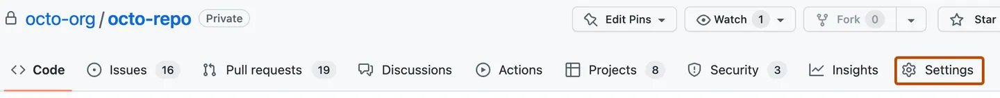
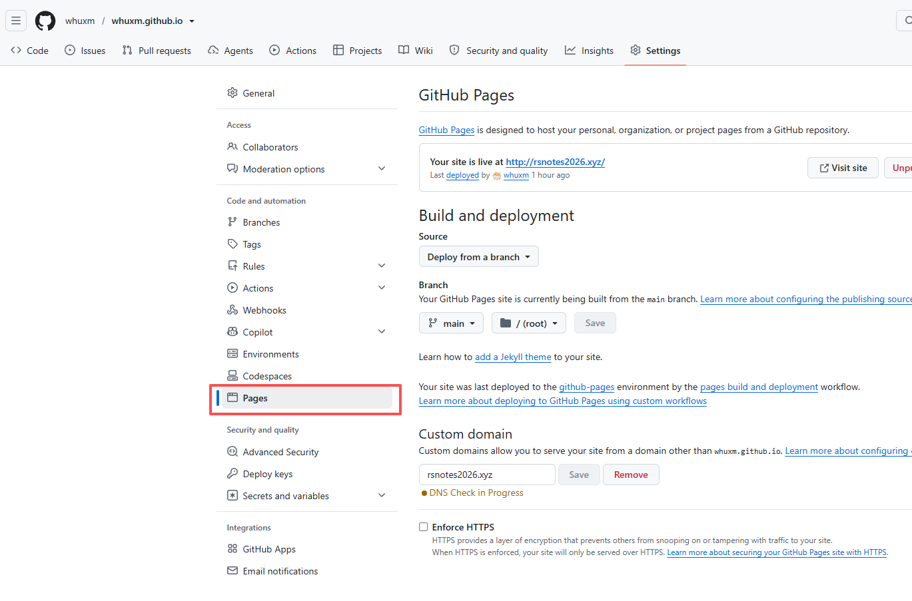

## 一、Github Page创建
1.新建仓库，并在建立界面以你的GitHub用户名作为仓库名称。
> 
> #仓库名称   username.github.io
> 
2.进入仓库，点击设置，进入Page进行相关设置后save即可

3.在仓库中建立一个**index.html**文件，即可在里面设计网页
- 注意此步之后，可以直接通过username.github.io访问

## 二、域名更换
购买一个域名（此处以阿里云为例），由于*username.github.io*是国外的服务器，国内连接不顺畅，故使用Cloudflare进行网络加速。

1.购买一个域名

2.注册Cloudflare后，添加站点，输入域名，选择免费计划

然后我们将得到这两个DNS服务器地址：
- bob.ns.cloudflare.com
- serena.ns.cloudflare.com

3.在阿里云进入**域名控制台**

点击DNS管理下的DNS修改，进行**修改DNS服务器**

将从第2步获取的地址复制上去，左下角**确定保存**

4.进入Cloudflare的DNS Records页面，依照下表添加两条记录
| 类型（）Type | 名称（Name） | 目标值（Target） |
| :---: | :---: | :---: |
| CNAME | www | user.github.io |
| CNAME | @ | user.github.io |

5.最后进入仓库setting的pages，在Custom domain中**填入域名并保存**

