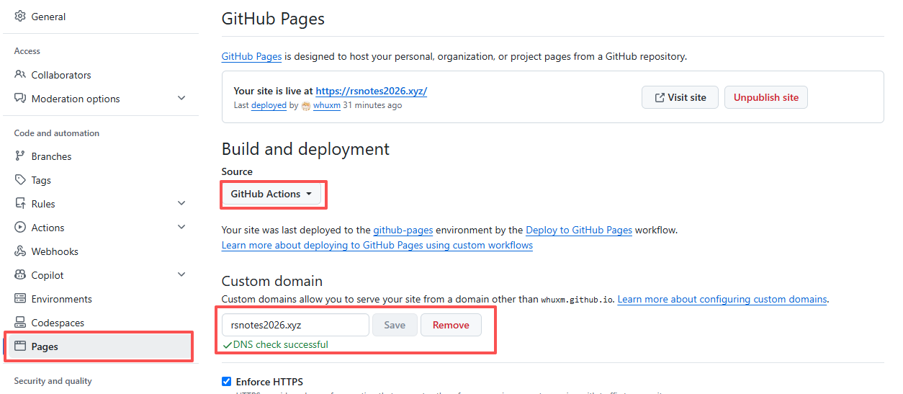

> 由于本人疏忽，在GitHub pages的设置中，Build and deployment的更改只改了Soure部分，忘记把Custom Dowmain添加域名。导致出现Ai解决不了的问题，以及浪费相当多的token，由于使用Cloudflare进行自定义域名，而没有和Ai说清楚。

astro上传GitHub，按照正常的流程，在```astro.config.mjs```文件中进行配置：

```js
export default defineConfig({
site: 'https://whuxm.github.io',    //正常的是直接访问地址
base: '/',
})
```
并且在github pages中的uild and deployment下的Soure改为**GitHub action**即可

----

如果使用了自定义域名，则需要将```astro.config.mjs```文件中配置为：

```js
export default defineConfig({
site: 'https://rsnotes2026.xyz',    //这里换上自定义的域名
base: '/',
})
```
并且在仓库设置中的pages部分，将Custom Dowmain添加自定义域名


