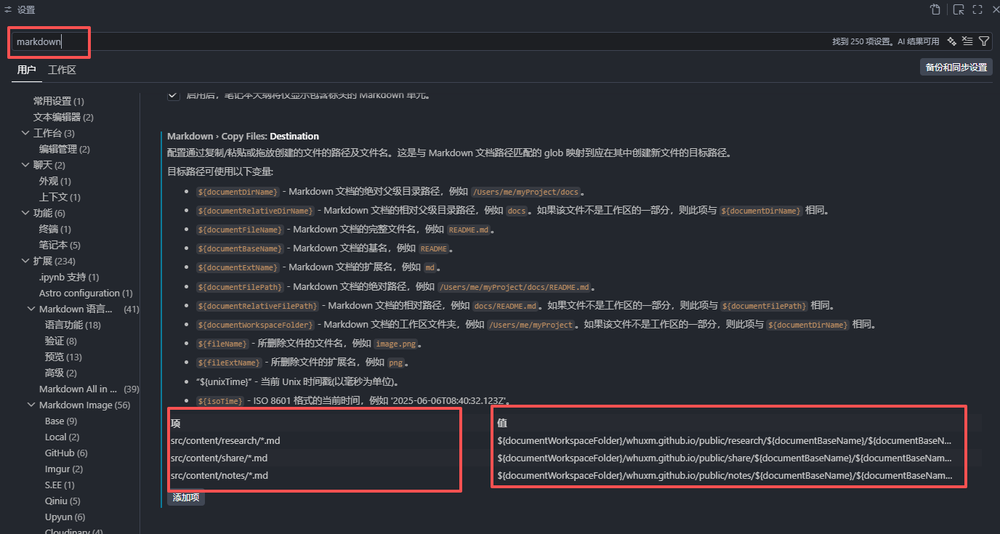
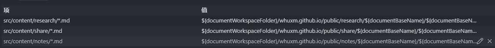
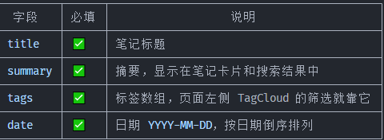
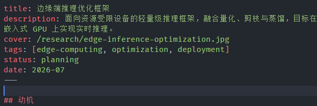
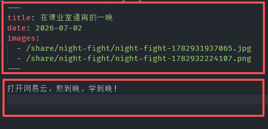

> 本章节将介绍如何在这个网站中添加内容，包括**科研、笔记、分享**三个部分

在开始设置好Markdown Copy Files的相关配置，会更加适配Astro架构
打开设置 -> 搜索markdown -> 在此处设置key（项）和value（值）
它的规则是：
```
 左边（key）  = 匹配 md 文件路径（glob）
 右边（value）= 图片保存目标路径
 ```



现在的架构是md文件放在：

```
src/
└── content/
    ├── notes/
    │   ├────── note1.md
    │   └────── note2.md
    ├── research/
    │   ├────── paper1.md
    │   └────── paper2.md
    └── share/
        └────── share1.md

```
而图片放在：
```
public/
├── notes/
│   ├── article-a/
│   │   ├── img1.png
│   │   └── img2.png
│   └── article-b/
├── research/
│   └── paper-a/
└── share/
    └── post-a/

```
所以需要设置好相对应的key,对应每一个模块，以notes模块为例，设定值为：```src/content/notes/*```，这里的*代表会匹配该路径下的所有文件。如果要严谨一点，可以设定为```src/content/notes/*.md```

然后对应到右边的value，设定值为```${documentWorkspaceFolder}/whuxm.github.io/public/notes/${documentBaseName}/${documentBaseName}-${unixTime}.${fileExtName}```

这里进行拆解，前面的```${documentWorkspaceFolder}/whuxm.github.io/public/notes/```部分：
```${documentWorkspaceFolder}``` **代表**当前工作目录根目录
后面根据目录来选择对应的```notes\```
```article-a/```这里应该为是文章名字
```${documentBaseName}```  **代表**匹配的文件基名，也就是我们要新建的文件名。
```${documentBaseName}-${unixTime}.${fileExtName}```这个部分是图片的命名，```.${fileExtName}```用以确保图片格式（.jpg、.png之类的）

完成上面的设置后如下图所示


## 1.笔记构建

在下面的目录中新建一个```xxx.md```文件：

```javascript
src/content/notes/...
```

```xxx.md```文件内的开头应该为：

```astro
---
  title: 如何新添加一个笔记？
  summary: 本内容将详细讲述如何在技术笔记部分新添加一个笔记
  tags: [基础, 教程]
  date: 2026-07-02
---
```


之后直接正常写markdown就可以啦！

## 2.科研内容构建



## 3.分享内容部分

基本结构相同


此处的图片可直接粘贴复制，修改成相对路径即可